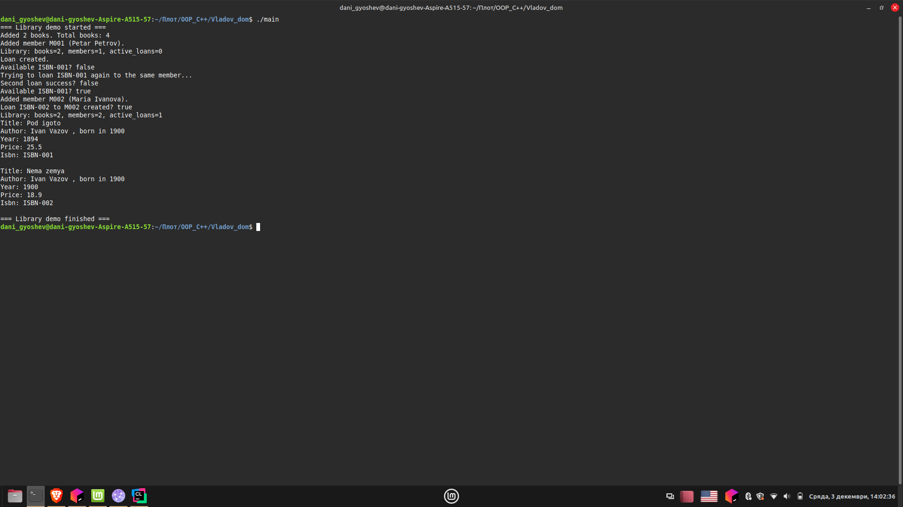

# Проект: Мини библиотечна система (Library System)

## Описание

Проектът представлява малка C++ система, която моделира работа на библиотека чрез основни ООП класове: `Author`, `Book`, `Member`, `Loan` и управляващ клас `Library`.  
Демонстрират се ключови обектно-ориентирани техники в C++:

- конструктори, деструктори и списъци за инициализация;
- капсулация и достъп чрез getters/setters;
- `const`-коректност и елементарна валидация на входните данни;
- статични членове (например брояч на създадени книги);
- прости алгоритми и структури от данни (търсене по автор и др.).

---

## Структура на проекта

```
Library_projecr/
├── CMakeLists.txt
├── pictures/
│   ├── console.png
├── include/
│   ├── Author.h
│   ├── Book.h
│   ├── Library.h
│   ├── Member.h
│   └── loan.h
└── src/
    └── main.cpp
```

---

## Компилация и изпълнение

Отворете терминал в директорията на проекта и използвайте един от следните варианти:

```bash
# Бърз вариант (както е поискано):
g++ main.cpp -o main
```

Забележка: Горната команда работи само ако main.cpp е в текущата директория и всички include пътища са видими. За актуалната структура на проекта използвайте:

```bash
# Препоръчително за тази структура:
g++ src/main.cpp -Iinclude -std=c++14 -o main
./main
```

Алтернативно, чрез CMake:

```bash
mkdir -p cmake-build-debug && cd cmake-build-debug
cmake ..
cmake --build .
./Vladov_dom
```

---

## Примерен изход

Реален конзолен изход от демо изпълнение (екранна снимка):



---

## Класове

### Клас `Author`
Представя автор с име и година на раждане. Използва се от `Book`.

### Клас `Book`
Описва книга: заглавие, автор (`Author`), година на издаване, цена, ISBN. Поддържа статичен брояч на създадените книги (`Book::totalBooks`) и методи като `to_string()` и `getTotalBook()`.

### Клас `Member`
Представя член на библиотеката: име, членски номер (ID), година на присъединяване.

### Клас `Loan`
Моделира заем: връзка между книга (по ISBN) и член (по ID) с дати на заемане и падеж за връщане. Използва се от `Library` за проследяване на наличности.

### Клас `Library`
Управлява колекции от `Book`, `Member` и активни `Loan` обекти. Предлага операции:
- `addBook` / `addMember` — добавяне на книги и членове;
- `loanBook` / `returnBook` — създаване и приключване на заеми;
- `isBookAvailable` — проверка за наличност на книга по ISBN;
- `findByAuthor` — търсене на книги по автор, поддържа частично съвпадение на имената;
- `to_string` — обобщена информация за текущото състояние на библиотеката.

---


## Автор

**Име:** Йордан Гьошев
**Номер:** 22318
**Курс:** Обектно-ориентирано програмиране (C++)  
**Дата:** 03.12.2025г
